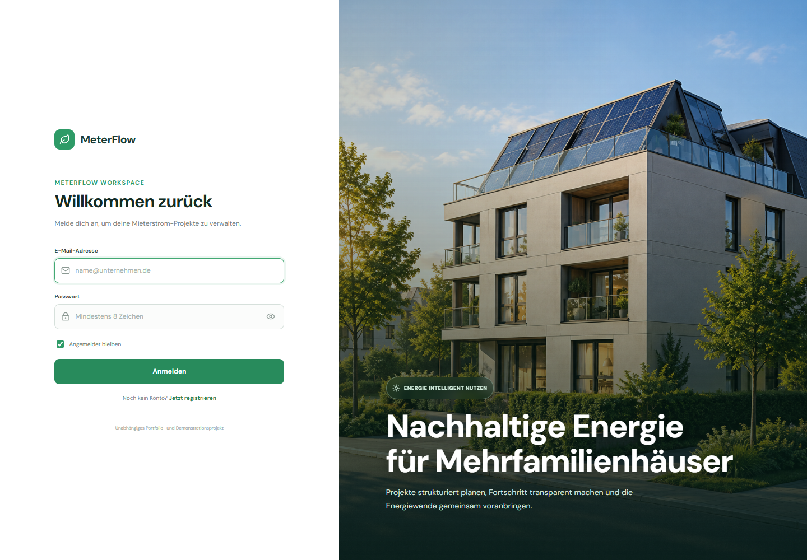
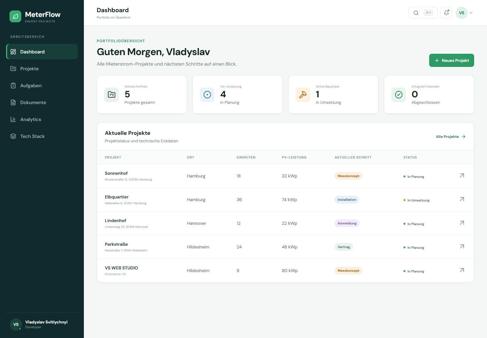
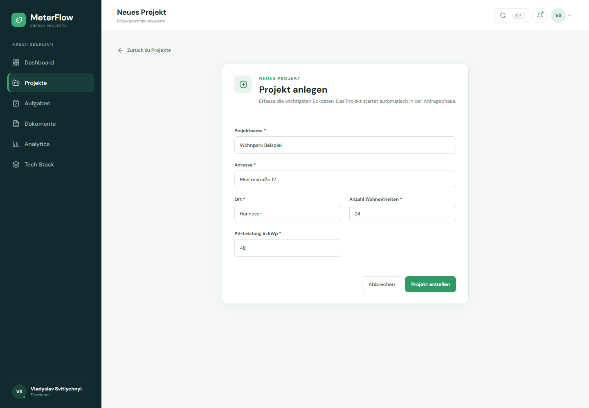
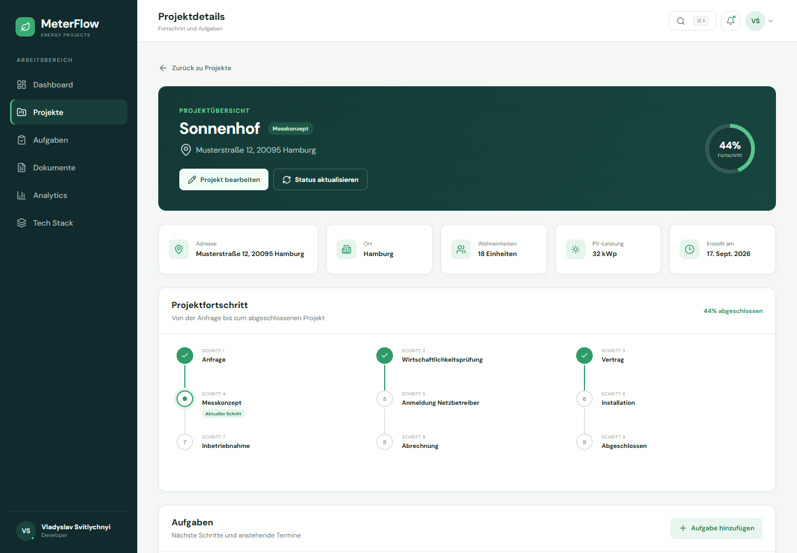
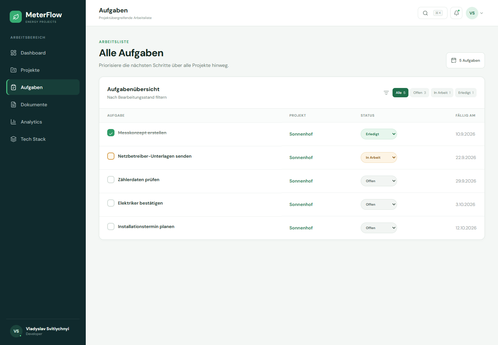
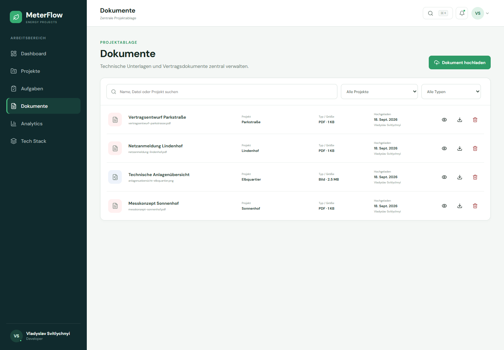
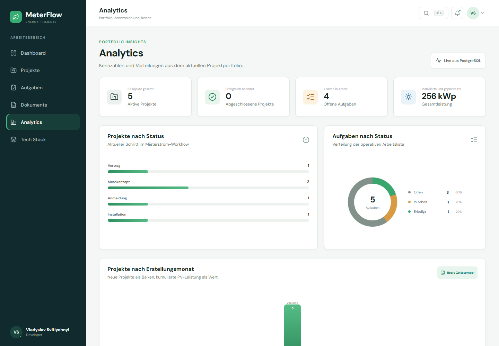
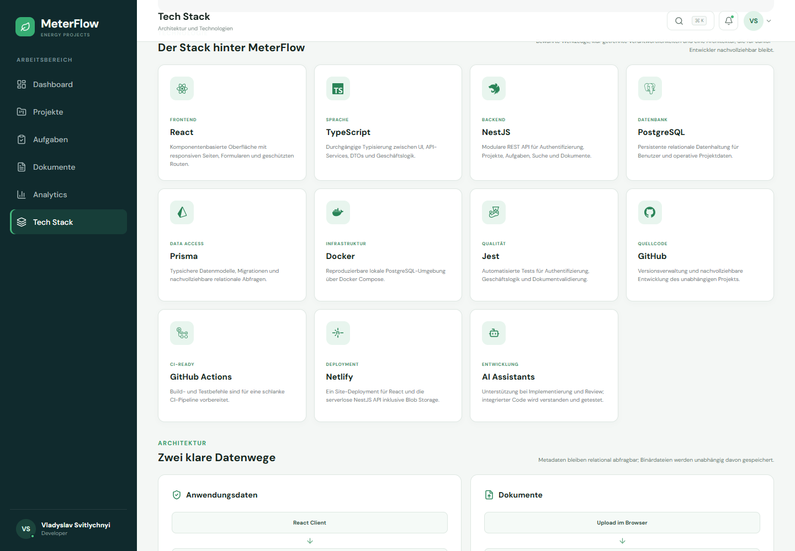
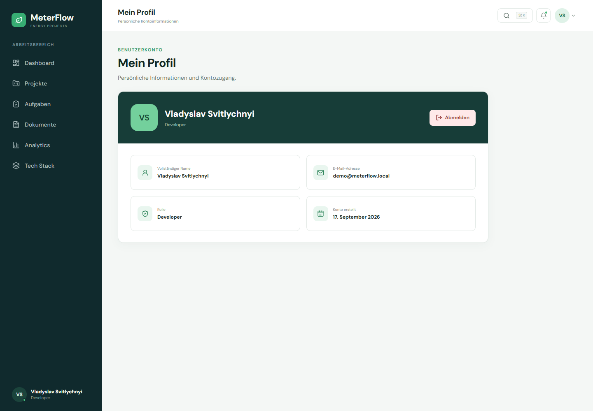

# MeterFlow

<p align="center">
  <strong>A full-stack EnergyTech demo for managing Mieterstrom projects from first inquiry to commissioning.</strong>
</p>

<p align="center">
  React · TypeScript · NestJS · PostgreSQL · Prisma · Docker · Netlify
</p>

> **Independent portfolio project.** MeterFlow is not an official metergrid product and is not affiliated with metergrid. It was created as a targeted application/demo project inspired by publicly described Mieterstrom workflows and the technology expectations of a Junior Fullstack Developer role in the German EnergyTech sector.

---

## Why this project exists

MeterFlow was created to answer a simple question with working software instead of another generic cover letter:

**Can I understand a real business process, translate it into a usable product workflow, and implement it end to end with the technologies a modern EnergyTech team actually uses?**

The demo focuses on the lifecycle of a simplified Mieterstrom project:

```text
Anfrage
  ↓
Wirtschaftlichkeitsprüfung
  ↓
Vertrag
  ↓
Messkonzept
  ↓
Anmeldung Netzbetreiber
  ↓
Installation
  ↓
Inbetriebnahme
  ↓
Abrechnung
  ↓
Abgeschlossen
```

The application was intentionally built around practical product work rather than a decorative landing page. It includes authentication, project workflows, tasks, documents, analytics, search, profile handling, API validation, PostgreSQL persistence, and a serverless deployment architecture.

---

## What MeterFlow demonstrates

MeterFlow is meant to demonstrate that I can work across the complete web application stack:

- turn a business process into a structured digital workflow;
- build responsive React interfaces with TypeScript;
- create modular NestJS APIs;
- model relational data with PostgreSQL and Prisma;
- implement authentication and protected routes;
- persist and retrieve real application data;
- create project-related document management;
- build operational dashboards and analytics;
- handle loading, empty, success, validation, and error states;
- work with Docker locally and serverless deployment in production;
- use AI coding assistants as development tools while still reviewing, understanding, testing, and owning the code that is integrated.

This project is deliberately scoped as a realistic junior-level product demo: broad enough to show end-to-end understanding, but small enough to remain explainable and maintainable.

---

## Live demo

**Production:** https://meterflow-demo.netlify.app

> The production backend is currently being finalized for Netlify serverless runtime compatibility. The local full-stack version is fully usable with Docker PostgreSQL.

---

## Product overview

### Authentication

Users can register, log in, remain authenticated through JWT-based sessions, access protected routes, view their profile, and log out.

<!-- Screenshot file: docs/screenshots/01-login.png -->


### Dashboard

The dashboard gives an immediate overview of the active portfolio: total projects, planning stages, projects in implementation, completed projects, and the most relevant project data.

<!-- Screenshot file: docs/screenshots/02-dashboard.png -->


### Project management

Projects can be created and edited with validated forms. Core data includes project name, address, location, number of housing units, PV capacity, and workflow status.

<!-- Screenshot file: docs/screenshots/03-project-create.png -->


### Project detail & workflow

Each project has a dedicated detail page with technical information, its current stage, progress through the complete nine-stage workflow, tasks, and related documents.

<!-- Screenshot file: docs/screenshots/04-project-detail.png -->


### Task management

Tasks can be created per project, assigned a due date, and moved between **Offen**, **In Arbeit**, and **Erledigt**. A global task page provides a cross-project operational view.

<!-- Screenshot file: docs/screenshots/05-tasks.png -->


### Document management

Documents are linked to specific projects. The interface supports filtering, upload, preview for supported formats, download, and deletion.

Supported initial formats:

- PDF
- PNG / JPEG
- DOC / DOCX
- XLS / XLSX

<!-- Screenshot file: docs/screenshots/06-documents.png -->


### Analytics

The analytics page derives its metrics from real project and task data instead of hardcoded dashboard values.

It currently includes:

- active and completed projects;
- open tasks;
- total PV capacity;
- projects by workflow stage;
- tasks by status;
- projects created by month;
- cumulative PV capacity.

<!-- Screenshot file: docs/screenshots/07-analytics.png -->


### Technology overview

The application contains an in-product architecture and technology page so reviewers can quickly see not only **what** was built, but also **how** it was built.

<!-- Screenshot file: docs/screenshots/08-tech-stack.png -->


### User profile

Authenticated user information is displayed in a dedicated profile view with name, email, role, account date, and logout action.

<!-- Screenshot file: docs/screenshots/09-profile.png -->


---

## Main features

- Responsive EnergyTech dashboard
- Registration, login, JWT authentication, protected routes, profile, logout
- Project creation and editing
- Nine-stage Mieterstrom workflow
- Project progress calculation
- Project-related task management
- Cross-project task view
- PostgreSQL persistence
- Document upload and project assignment
- Document preview, download, filtering, and deletion
- Analytics based on real stored data
- Global search across projects, tasks, and documents
- Notification UI derived from project/task activity
- Loading, empty, validation, success, and API error states
- Responsive desktop, tablet, and mobile layout
- Reusable modal and toast components
- Jest backend tests
- Docker-based local PostgreSQL
- Netlify Functions deployment architecture
- Netlify Blobs integration for production document storage

---

## Architecture

```text
                   ┌─────────────────────────────┐
                   │      React + TypeScript      │
                   │          Vite SPA            │
                   └──────────────┬──────────────┘
                                  │
                             REST /api
                                  │
                   ┌──────────────▼──────────────┐
                   │          NestJS API          │
                   │  Auth · Projects · Tasks    │
                   │ Documents · Search · Health │
                   └──────────┬───────────┬──────┘
                              │           │
                           Prisma      File Storage
                              │           │
                   ┌──────────▼───┐   ┌───▼──────────────┐
                   │ PostgreSQL   │   │ Local filesystem │
                   │ relational DB│   │ / Netlify Blobs  │
                   └──────────────┘   └──────────────────┘
```

### Local development

```text
React :5173
   ↓
NestJS :3000
   ↓
Prisma
   ↓
PostgreSQL :5432 (Docker)
```

### Production target

```text
Netlify static frontend
        ↓
      /api/*
        ↓
Netlify Function
        ↓
NestJS
        ↓
PostgreSQL
```

Documents are stored separately from relational metadata:

```text
Document metadata → PostgreSQL
Actual file bytes → local filesystem / Netlify Blobs
```

---

## Technology stack

| Technology | Role in MeterFlow |
| --- | --- |
| **React** | Component-based frontend UI |
| **TypeScript** | End-to-end type safety across frontend and backend |
| **Vite** | Frontend development and production build tooling |
| **React Router** | Client-side routing and protected application routes |
| **NestJS** | Modular REST backend |
| **PostgreSQL** | Relational persistence for users, projects, tasks, and document metadata |
| **Prisma** | Schema, migrations, and type-safe data access |
| **Docker** | Reproducible local PostgreSQL environment |
| **Jest** | Backend unit testing |
| **Netlify** | Frontend hosting and serverless backend target |
| **Netlify Blobs** | Production document binary storage |
| **Git / GitHub** | Version control and development history |
| **AI coding assistants** | Implementation support, debugging, review, and iteration |

---

## Data model

The central relationships are intentionally simple and product-focused:

```text
User
 └── Documents uploaded by user

Project
 ├── Tasks
 └── Documents

Task
 └── belongs to Project

Document
 ├── belongs to Project
 └── uploaded by User
```

Important project fields include:

- project name;
- city and address;
- number of housing units;
- PV capacity;
- current project status;
- creation/update timestamps.

---

## API overview

### Authentication

| Method | Endpoint | Purpose |
| --- | --- | --- |
| `POST` | `/api/auth/register` | Create account |
| `POST` | `/api/auth/login` | Log in and receive JWT |
| `GET` | `/api/auth/me` | Retrieve authenticated user |

### Projects

| Method | Endpoint | Purpose |
| --- | --- | --- |
| `GET` | `/api/projects` | List projects |
| `GET` | `/api/projects/:id` | Project details |
| `POST` | `/api/projects` | Create project |
| `PATCH` | `/api/projects/:id` | Update project |
| `GET` | `/api/projects/:id/tasks` | Project tasks |
| `POST` | `/api/projects/:id/tasks` | Add project task |

### Tasks

| Method | Endpoint | Purpose |
| --- | --- | --- |
| `GET` | `/api/tasks` | Cross-project task list |
| `PATCH` | `/api/tasks/:id` | Update task status |

### Documents

| Method | Endpoint | Purpose |
| --- | --- | --- |
| `GET` | `/api/documents` | List documents |
| `GET` | `/api/projects/:projectId/documents` | Documents for one project |
| `POST` | `/api/documents` | Upload a document |
| `GET` | `/api/documents/:id/download` | Download/preview a document |
| `DELETE` | `/api/documents/:id` | Delete document and metadata |

### Search & health

| Method | Endpoint | Purpose |
| --- | --- | --- |
| `GET` | `/api/search?q=` | Search projects, tasks, and documents |
| `GET` | `/api/health` | Backend health check |

---

## Repository structure

```text
meterflow-demo/
├── frontend/
│   ├── public/
│   └── src/
│       ├── auth/
│       ├── components/
│       ├── pages/
│       ├── services/
│       └── types/
│
├── backend/
│   ├── prisma/
│   │   ├── migrations/
│   │   ├── schema.prisma
│   │   └── seed.ts
│   └── src/
│       ├── auth/
│       ├── documents/
│       ├── health/
│       ├── prisma/
│       ├── projects/
│       ├── search/
│       └── tasks/
│
├── netlify/
│   └── functions/
├── docs/
│   └── screenshots/
├── docker-compose.yml
├── netlify.toml
├── package.json
└── README.md
```

---

## Run locally

### Requirements

- Node.js 20+
- npm
- Docker Desktop

### 1. Environment

From the repository root:

```bash
cp .env.example backend/.env
```

On PowerShell:

```powershell
Copy-Item .env.example backend/.env
```

### 2. Start PostgreSQL

```bash
docker compose up -d postgres
docker compose ps
```

### 3. Start the backend

```bash
cd backend
npm install
npm run prisma:generate
npm run prisma:deploy
npm run prisma:seed
npm run start:dev
```

Backend:

```text
http://localhost:3000
```

Health check:

```text
http://localhost:3000/api/health
```

### 4. Start the frontend

Open another terminal:

```bash
cd frontend
npm install
npm run dev
```

Frontend:

```text
http://localhost:5173
```

---

## Local demo credentials

```text
E-Mail: demo@meterflow.local
Passwort: MeterFlow2026!
```

These credentials are intended only for local demonstration data.

---

## Environment variables

### Local backend

```text
DATABASE_URL
JWT_SECRET
NODE_ENV=development
PORT=3000
```

### Production

```text
DATABASE_URL
JWT_SECRET
NODE_ENV=production
```

Secrets must never use the `VITE_` prefix and must never be exposed to the browser.

---

## Testing

Backend tests:

```bash
cd backend
npm test
```

Build checks:

```bash
npm run build
npm test --prefix backend
npx prisma validate --schema backend/prisma/schema.prisma
git diff --check
```

The project includes focused backend coverage for authentication, projects, tasks, and document handling rather than chasing a meaningless coverage percentage.

---

## Development approach

AI-assisted development is intentionally part of this project because modern development teams increasingly use coding assistants in daily workflows.

The rule used throughout MeterFlow is simple:

> **AI output is a proposal, not a result.**

Generated or suggested code is reviewed, understood, tested, and adjusted before integration.

This approach is especially relevant to the type of development workflow described in the role that inspired the project.

---

## What I learned

MeterFlow moved beyond the parts of the stack I already knew best.

The project required me to work through:

- NestJS architecture instead of only Express;
- relational modelling in PostgreSQL instead of relying only on document databases;
- Prisma migrations and relational queries;
- JWT-based protected APIs;
- serverless backend constraints;
- production versus local environment configuration;
- document storage architecture;
- deployment debugging across frontend, backend, database, and runtime boundaries.

The deployment work was particularly valuable: a system that works locally is not automatically production-ready, and debugging the complete path from browser request to serverless runtime to database became an important part of the project itself.

---

## Scope and limitations

MeterFlow is a portfolio/demo system, not a production Mieterstrom platform.

It intentionally does **not** attempt to implement:

- legally binding energy billing;
- real Netzbetreiber integrations;
- payment processing;
- complete authorization/role management;
- production-grade audit logging;
- real-world energy-market regulation;
- full ERP functionality.

The purpose is to demonstrate software engineering, product understanding, and the ability to learn a domain quickly without pretending that a small demo replaces a real energy platform.

---

## Author

**Vladyslav Svitlychnyi**  
Junior Full-Stack Developer

Focus:

- React / TypeScript
- Node.js / NestJS
- REST APIs
- PostgreSQL
- modern responsive web applications
- product-oriented full-stack development

---

## Screenshots

The README expects the following screenshots:

```text
docs/screenshots/
├── 01-login.png
├── 02-dashboard.png
├── 03-project-create.png
├── 04-project-detail.png
├── 05-tasks.png
├── 06-documents.png
├── 07-analytics.png
├── 08-tech-stack.png
└── 09-profile.png
```

Recommended format:

- PNG or WebP
- desktop width around 1440–1600 px
- crop browser chrome where possible
- do not include passwords, tokens, private email addresses, or developer-console secrets

Once those files are added, GitHub renders them automatically in the sections above.

---

<p align="center">
  <strong>MeterFlow</strong><br/>
  Independent full-stack EnergyTech portfolio project
</p>
